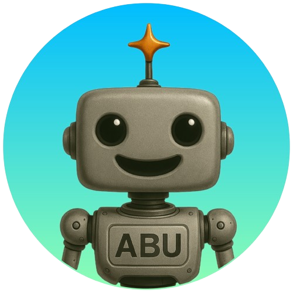

# 🤖 ABU – Asistente de Bienestar Único 💜
> Un asistente virtual empático que acompaña, escucha y conecta.


ABU es un asistente virtual conversacional desarrollado con Python y Streamlit, pensado para brindar apoyo emocional, compañía, recordatorios y asistencia personalizada a personas adultas mayores, aunque su diseño empático e inclusivo permite que se adapte a cualquier tipo de usuario.

<p align="center">
  
</p>

---


## 🚀 Visión del Proyecto

**ABU nace desde la empatía, la tecnología y la vocación de ayudar.** Es una herramienta digital que busca mejorar la calidad de vida de sus usuarios a través del acompañamiento conversacional, la contención emocional y la asistencia diaria.

La tecnología debe estar al servicio de las personas, y ABU representa ese puente entre lo humano y lo digital.

---

## 🧠 ¿Qué es ABU?

ABU es un asistente virtual empático, que escucha con atención, conversa con calidez y acompaña con inteligencia. Gracias al uso de inteligencia artificial generativa, ABU es capaz de mantener conversaciones naturales y adaptadas a cada usuario, generando una experiencia más cercana, significativa y humana.


---

## 🧠 Componentes de Inteligencia Artificial

ABU combina múltiples tecnologías de IA para brindar una experiencia cálida y útil:

| Componente                       | Descripción                                                                 |
|----------------------------------|-----------------------------------------------------------------------------|
| 💬 **IA Generativa (NLP)**       | Generación de respuestas naturales, personalizadas y empáticas.            |
| 🗂️ **Procesamiento de Contexto** | Identificación de intenciones, estados de ánimo y temas relevantes.        |
| 🔄 **Memoria de Sesión**         | Adaptación dinámica a las necesidades del usuario durante la conversación. |
| 📡 **Integración con APIs**      | Acceso a datos en tiempo real como clima, noticias y recordatorios.        |

---

## ⚙️ Funcionalidades actuales

- 🗣️ Conversaciones empáticas adaptadas al perfil del usuario.
- ⏰ Recordatorios para turnos médicos y rutinas diarias.
- 📰 Presentación de noticias de forma clara y sencilla.
- 🌤️ Información meteorológica local y consejos útiles.
- 🆘 Envío automático de ubicación ante emergencias.
- 💬 Acompañamiento emocional y compañía digital.
- 👓 Interfaz accesible, legible y moderna.

---

## 🌱 Escalabilidad y Metas Futuras

- Telemedicina y agendado de turnos médicos automático.
- Educación digital y acompañamiento terapéutico.
- Integración con servicios de emergencia.
- Ampliación de habilidades mediante IA generativa.
- Expansión de idioma y soporte multimedia (voz, imágenes).

---

## 📂 Estructura del Proyecto

```
abu/
│
├── app.py                 # App principal de Streamlit
├── .env                  # Variables de entorno (API keys, configs)
├── requirements.txt       # Dependencias
├── IMG/                   # Carpeta de imágenes (íconos, logos)
├── noticias/              # Módulo de noticias
├── recordatorio/          # Módulo de recordatorios
├── conversacion/          # Módulo de diálogo principal
├── ayuda/                 # Módulo de ayuda
└── README.md              # Este archivo :)
```

---

## ▶️ Despliegue

ABU puede ejecutarse **de forma local** o ser **desplegado online** utilizando [Streamlit Cloud](https://streamlit.io/cloud).  
A continuación, se detallan ambas opciones:

---

### 💻 Ejecución local

Ideal para desarrollo, pruebas o uso personal desde tu entorno:

1. Cloná el repositorio:

```bash
git clone https://github.com/tu_usuario/abu.git
cd abu
```

2. Instalá las dependencias:

```bash
pip install -r requirements.txt
```

3. Configurá tus variables de entorno en un archivo `.env` ubicado en la raíz del proyecto.  
Ejemplo:

```
API_CLIMA_KEY=tu_clave
API_NOTICIAS_KEY=otra_clave
```

> ⚠️ El archivo `.env` **no debe subirse** al repositorio, por eso está incluido en el archivo `.gitignore`.

4. Ejecutá la aplicación:

```bash
streamlit run app.py
```

---

### ☁️ Despliegue en Streamlit Cloud

ABU está listo para desplegarse fácilmente en la nube usando [Streamlit Cloud](https://streamlit.io/cloud):

1. Subí el proyecto a un repositorio (público o privado) en GitHub.
2. Ingresá a [Streamlit Cloud](https://streamlit.io/cloud) y conectá tu cuenta de GitHub.
3. Seleccioná el repositorio que contiene ABU.
4. En la sección de configuración, añadí las **Secrets** necesarias desde el panel "Secrets", en el siguiente formato:

```
API_CLIMA_KEY="tu_clave"
API_NOTICIAS_KEY="otra_clave"
```

5. Hacé clic en **Deploy** y ¡listo! La aplicación estará corriendo online.

> 📌 En este caso, `app.py` ya está adaptado para leer las claves desde `st.secrets` en lugar del archivo `.env`.


---

## 🔐 Seguridad

Las credenciales sensibles como API Keys se manejan a través de un archivo `.env` y se recomienda agregar `.env` al archivo `.gitignore` para proteger la información confidencial al subirlo a GitHub.

---

## 🙋 Sobre mí

Mi nombre es **Carlos Ezequiel Leiva**, soy estudiante de Ciencia de Datos e Inteligencia Artificial y entusiasta de la tecnología con propósito social.

📍 Vivo en Buenos Aires, Argentina.  
📎 [Mi LinkedIn](https://www.linkedin.com/in/c-e-leiva)

---

## 🤝 Colaboraciones

¿Querés colaborar con el proyecto, dar feedback o explorar alianzas para escalar ABU?  
¡Estoy completamente abierto a conversaciones, ideas o propuestas! 😊  
Si representás una empresa, entidad gubernamental, centro de salud o institución interesada en implementar ABU, no dudes en contactarme.

📩 **Correo:** xc.leiva@gmail.com

---

# Licencia

ABU se distribuye bajo un esquema de **licencia dual**:

- ✅ Para **uso personal, educativo o no comercial**, se aplica la [Licencia MIT](LICENSE).
- 💼 Para **uso comercial**, distribución con fines lucrativos o integración en productos propietarios, se requiere una [licencia comercial](LICENSE_COMERCIAL.md).

## 📌 Términos generales

- El uso de ABU con fines comerciales o en entornos institucionales (empresas, gobiernos, ONGs, centros de salud, etc.) requiere una **autorización expresa** del autor, Carlos Ezequiel Leiva.
- No está permitido redistribuir, revender, integrar ni utilizar ABU como parte de un producto o servicio comercial sin esta autorización.
- Cualquier uso no autorizado será considerado una infracción a los derechos de autor y podrá ser objeto de acciones legales conforme a la legislación vigente.

## 🔑 Obtención de licencia

Para obtener una licencia comercial, contactarse directamente con el autor a través de:

📩 **Correo:** xc.leiva@gmail.com  

Toda colaboración o acuerdo comercial será tratado de forma confidencial, y se definirá mediante un contrato personalizado entre las partes.

---

**ABU © 2025** - Proyecto en desarrollo por **Carlos Ezequiel Leiva**. Todos los derechos reservados.

---

💜 Gracias por interesarte en ABU.  
Si llegaste hasta acá, ya estamos más cerca de construir tecnología con alma.


