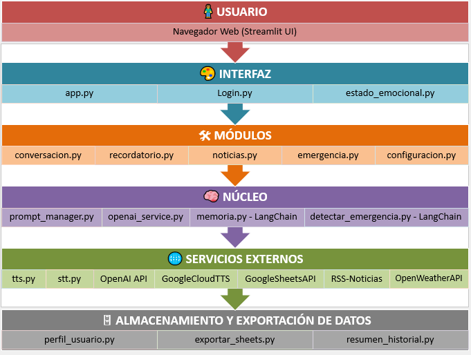

# 🤖 ABU-GENAI-V2 – Asistente Conversacional con IA Generativa  
> Evolución conversacional con GPT-4 Turbo, voz y acompañamiento emocional
> 🔁 Este proyecto es una evolución del asistente [ABU-IA-Generativa (v1)](https://github.com/c-e-leiva/ABU-IA-Generativa)


🎧 **Probá ABU en vivo:**  
[](https://abu-genai-v2.streamlit.app)


<p align="center">
  
</p>

---

---

## 📋 Índice

1. [¿Qué es ABU?](#qué-es-abu)  
2. [Novedades en la versión 2](#novedades-en-la-versión-2)  
3. [Funcionalidades principales](#funcionalidades-principales)  
4. [Objetivo](#objetivo)  
5. [Estructura del Proyecto](#estructura-del-proyecto)  
6. [Requisitos previos](#requisitos-previos)  
7. [Instalación y ejecución](#instalación-y-ejecución)  
8. [Diagrama de Arquitectura](#diagrama-de-arquitectura)  
9. [Manejo de errores y logs](#manejo-de-errores-y-logs)  
10. [Seguridad y privacidad](#seguridad-y-privacidad)  
11. [Futuras mejoras y roadmap](#futuras-mejoras-y-roadmap)  
12. [Ejemplos de conversación y datos](#ejemplos-de-conversación-y-datos)  
13. [Documentación Técnica](#documentación-técnica)  
14. [Sobre el Autor y el Proyecto](#sobre-el-autor-y-el-proyecto)

---

## ¿Qué es ABU?

**ABU** es un asistente virtual conversacional desarrollado en Python que utiliza **inteligencia artificial generativa (GPT-4 Turbo)** para brindar acompañamiento emocional, información útil, recordatorios y asistencia diaria.  
Además, **incorpora LangChain** para mantener el contexto de la conversación y detectar situaciones críticas de forma dinámica.

Está diseñado especialmente para adultos mayores, pero puede adaptarse a cualquier usuario. Ofrece un diálogo cálido, empático y personalizado, con soporte por voz y texto.

---

## Novedades en la versión 2

- Migración a **GPT-4 Turbo** para mejor rendimiento y personalización.  
- Integración con **Google Cloud Text-to-Speech** para respuestas en voz natural.  
- Soporte para entrada por **voz** mediante Speech-to-Text.  
- Reestructura modular para mayor mantenibilidad.  
- Incorporación de **LangChain** para gestionar la memoria conversacional y detección de emergencias mediante flujos dinámicos.
- Flujo conversacional adaptativo con detección de emociones.  
- Comandos contextuales para clima, noticias y recordatorios.  
- Botón para eliminar audios generados por cada mensaje.  
- Preparado para escalar usando Google Sheets como almacenamiento inicial.

---

## Funcionalidades principales

- **Conversación empática:** respuestas personalizadas según perfil y estado emocional.  
- **Lectura por voz:** síntesis de voz para respuestas.  
- **Entrada por voz:** permite hablar para interactuar con ABU.  
- **Noticias y clima:** acceso a información actualizada según ubicación.  
- **Recordatorios:** gestión personalizada de actividades y alertas.  
- **Emergencia:** envía mensajes de ayuda con ubicación a contactos configurados.


---

## Objetivo

Mejorar la calidad de vida de los usuarios mediante un asistente virtual que escucha, conversa y acompaña. El proyecto acerca la inteligencia artificial a personas con necesidades reales, especialmente adultos mayores.


---

## Estructura del Proyecto

```
ABU-GENAI-V2/
│
├── .env                         Variables de entorno con claves API y configuraciones privadas (no incluido)
├── .gitignore                   Lista de archivos y carpetas ignoradas por Git
├── README.md                    Documentación principal del proyecto
├── requirements.txt             Lista de dependencias necesarias para ejecutar la app
├── app.py                       Archivo principal que lanza la aplicación Streamlit
│
├── data/                        Datos exportados, backups y archivos temporales
│
├── assets/                      Recursos estáticos (imágenes, íconos, audios)
│   └── abu_logo.png             Logo del asistente ABU
│
├── credentials/                 Credenciales de servicios externos (no incluidas por seguridad)
│   ├── gcp-tts-credentials.json      Claves para Text-to-Speech (Google Cloud).
│   └── gcp-sheets-credentials.json   Claves para Google Sheets API.  
│
├── core/                        Lógica central del asistente
│   ├── prompt_manager.py        Generación y control del flujo de prompts
│   ├── openai_service.py        Integración con API de OpenAI
│   ├── memoria.py               gestión de memoria conversacional del asistente usando LangChain
│   └── detectar_emergencia.py   detectar situación de emergencia del usuario
│
├── features/                    Funcionalidades principales accesibles desde la interfaz
│   ├── conversacion.py          Módulo de conversación con el asistente
│   ├── noticias.py              Consulta del clima y noticias locales
│   ├── recordatorio.py          Gestión de recordatorios Personales
│   ├── emergencia.py            Gestión de contactos de emergencia
│   └── configuracion.py         Configuración del perfil del usuario
│
├── services/                    Servicios externos de entrada y salida de voz
│   ├── stt.py                   Conversión de voz a texto (Speech-to-Text)
│   └── tts.py                   Conversión de texto a voz (Text-to-Speech)
│
├── storage/                     Almacenamiento y Exportación de Datos
│   ├── resumen_historial.py     Genera resumen de la conversación para su exportación
│   ├── perfil_usuario.py        Gestión del perfil del usuario
│   └── exportar_sheets.py       Exporta el perfil completo y resumen a Google Sheets
│
├── users/                       Datos y lógica relacionados a los usuarios
│   ├── estado_emocional.py      Análisis emocional del usuario
│   └── perfiles_precargados.py  Perfiles de usuarios precargados (Rosa, Pedro, Juan).
│
├── access/                      Módulos relacionados al inicio de sesión
│   └── login.py                 Interfaz y lógica para el acceso de usuarios.
│
├── .streamlit/                  Configuración de Streamlit (archivo no incluido)
│   └── config.toml
│
├── docs/                        Documentación técnica (ver sección final para acceder)
│
└── venv/                        Entorno virtual (no incluido)
```
---


## ✅ Requisitos previos

- Python 3.10 o superior.  
- Acceso a APIs: OpenAI GPT-4 Turbo, Google Cloud Text-to-Speech, Google Sheets, OpenWeather.  
- Librerías indicadas en `requirements.txt`.

---

## 🚀 Instalación y ejecución

1. Clonar el repositorio.  
2. Crear y activar un entorno virtual Python.  
3. Instalar dependencias con `pip install -r requirements.txt`.   
4. Configurar las credenciales y variables de entorno:

- Colocar los archivos JSON con credenciales de Google Cloud dentro de la carpeta `credentials/` (no incluidos en el repositorio):
  - `gcp-tts-credentials.json` para Text-to-Speech  
  - `gcp-sheets-credentials.json` para Google Sheets API  

- Añadir las claves API necesarias en el archivo `.streamlit/config.toml` bajo la sección `[secrets]`, por ejemplo:

```
OPENAI_API_KEY="tu_api_key_aqui"
OPENWEATHER_API_KEY="tu_api_key_aqui"
NOTICIAS_API_KEY="tu_api_key_aqui"
OTHER_API_KEY=...
```

5. Ejecutar la aplicación con Streamlit (`streamlit run app.py`).

---

## Diagrama de Arquitectura

> Arquitectura funcional y modular del asistente ABU.



---

### 🔍 Descripción de las capas

#### 🧍 USUARIO  
El punto de inicio. El usuario final accede a la aplicación mediante un **navegador web**, utilizando la interfaz desarrollada en Streamlit.

#### 🎨 INTERFAZ  
Compuesta por `app.py`, `login.py` y `estado_emocional.py`, esta capa gestiona la experiencia de usuario: visualización, navegación, ingreso y configuración básica del estado emocional.  
Es la puerta de entrada hacia el resto del sistema.

#### 🛠 MÓDULOS  
Son funcionalidades accesibles directamente desde la interfaz. Cada módulo es independiente y maneja una tarea específica:
- `conversacion.py`: diálogo principal con el asistente.  
- `recordatorio.py`: agenda personalizada.  
- `noticias.py`: acceso a clima y noticias.  
- `emergencia.py`: alertas a contactos definidos.  
- `configuracion.py`: preferencias y ajustes del usuario.

#### 🧠 NÚCLEO  
Aquí se orquesta el flujo conversacional, la lógica central del asistente y las funcionalidades más complejas.  
Incluye:
- `prompt_manager.py`: gestión de mensajes e instrucciones al modelo.
- `openai_service.py`: conexión con la API de OpenAI.
- `memoria.py`: memoria conversacional del usuario (implementada con **LangChain**).
- `detectar_emergencia.py`: evalúa si una situación requiere activar protocolo de emergencia (usa **LangChain**).

#### 🌐 SERVICIOS EXTERNOS  
Integraciones que expanden las capacidades del asistente:
- `tts.py` / `stt.py`: conversión de texto a voz y voz a texto.
- **OpenAI GPT-4 / 3.5**: generación de respuestas naturales.
- **Google Cloud TTS**: síntesis de voz.
- **Google Sheets API**: almacenamiento inicial de datos estructurados.
- **OpenWeather API**: clima en tiempo real.
- **RSS Noticias**: acceso a noticias actuales.
- `credentials/`: credenciales necesarias para autenticar los servicios.

#### 🗄 ALMACENAMIENTO Y EXPORTACIÓN DE DATOS  
Centraliza todo lo necesario para guardar, estructurar o exportar información:
- `perfil_usuario.py`: consolida todos los datos del usuario.
- `exportar_sheets.py`: envía los datos del perfil y conversación a Google Sheets.
- `resumen_historial.py`: genera un resumen afectivo de la conversación para análisis o revisión posterior.


---

## Manejo de errores y logs

- El sistema captura errores comunes (fallas en conexión con APIs, errores en síntesis de voz, etc.) y muestra mensajes claros al usuario para mejorar la experiencia.  

---

## Seguridad y privacidad

- Las claves API y credenciales se almacenan localmente en archivos `.env` y `credentials/` que no se incluyen en el repositorio para proteger la información sensible.  
- No se almacena información sensible del usuario de forma permanente sin consentimiento.  

---

## Futuras mejoras y roadmap

| Mejora                        | Descripción                                              |
| ----------------------------- | -------------------------------------------------------- |
| Persistencia en base de datos | Migrar almacenamiento a Firestore o PostgreSQL           |
| Integración continua          | Automatizar pruebas y despliegues                        |
| Interfaces móviles            | Desarrollar apps nativas o Progressive Web App           |
| Accesibilidad mejorada        | Lectura automática, botones grandes, navegación sencilla |
| Soporte multilingüe           | Añadir idiomas adicionales                               |
| Seguimiento emocional         | Registro y análisis histórico de estados emocionales     |


---

## Ejemplos de conversación y datos

**💬 Simulación de interacción:**  

- **Usuario:** Hola Abu, ¿cómo estás hoy?  
- **ABU:** ¡Hola! 😊 Qué lindo recibir tu mensaje. Estoy bien, gracias por preguntar. ¿Y vos, cómo estás hoy? Recordá que estoy acá para acompañarte siempre 💙  
- **Usuario:** Estoy bien, gracias. ¿Podés contarme las noticias del día?  
- **ABU:** Claro. Estas son algunas de las noticias principales de hoy:  
  - El gobierno anunció nuevas medidas económicas para los próximos meses.  
  - Avances importantes en investigaciones sobre energías renovables.  
  - ¡Y buenas noticias! El equipo local ganó el campeonato nacional ⚽🎉  
- **Usuario:** Qué bueno. ¿Y cómo está el clima en Buenos Aires?  
- **ABU:** Hoy es viernes y son las 17:30 hs. En Buenos Aires está nublado, con una temperatura de aproximadamente 18°C.
- **Usuario:** Abu, necesito ayuda urgente.  

- *(Mensaje enviado al contacto de emergencia →)*  

  **🚨 Hola, soy ABU, el asistente virtual de *Usuario*.**  
  Está necesitando tu ayuda urgente y te tiene como contacto de emergencia.  
  📍 Su Ubicación estimada es: *Ubicacion del Usuario*  

- **ABU:** Ya envié un aviso a tu contacto de emergencia.  
  Mantené la calma, tu contacto ya fue notificado y te ayudará lo antes posible.  
  ¿Querés que reenvíe la alerta? ¿sí - no?  

- **Usuario:** No, gracias Abu.  
- **ABU:** Perfecto, salimos del modo de emergencia. Estoy acá si necesitás otra cosa. 💙


**Perfil de usuario ejemplo:**

| Nombre | Edad | Provincia | Estado Emocional | Vive Solo | Dificultades         | Preferencias                   |
|--------|------|-----------|------------------|-----------|----------------------|--------------------------------|
| Rosa   | 72   | Santa Fe  | Pensante         | Sí        | Memoria, Audición    | Noticias, Clima, Recordatorios |

**Recordatorios ejemplo:**

| Descripción           | Fecha       | Hora  |
|-----------------------|-------------|-------|
| Tomar la medicación   | 12/07/2025  | 08:00 |
| Llamar a Claudia      | 13/07/2025  | 18:30 |


---

## Documentación Técnica  
Toda la documentación técnica del proyecto está disponible en la carpeta [`/docs`](docs/), organizada por secciones temáticas:  
📄 [Ir al índice técnico](docs/index.md)

---

## Sobre el Autor y el Proyecto

### 🧠 Identidad del proyecto  
**ABU** es la sigla de *Asistente de Bienestar Único*.  
El nombre, el concepto y el logo del asistente son originales y fueron creados por el autor del proyecto.  
ABU está pensado como un puente humano entre tecnología y bienestar emocional, especialmente para personas mayores o con necesidades de acompañamiento.

### ⚖️ Propiedad intelectual  
Este proyecto fue desarrollado de forma independiente por **Carlos Ezequiel Leiva**.  
El nombre, el logo y el diseño funcional de ABU están protegidos por derechos de autor.  
Queda prohibida su reproducción, redistribución o comercialización sin autorización explícita del autor.  
Para consultas, colaboraciones o licencias, podés escribir a: **xc.leiva@gmail.com**


### 👤 Contacto  
**Autor:** Carlos Ezequiel Leiva  
📍 Buenos Aires, Argentina  
🔗 [LinkedIn](https://www.linkedin.com/in/c-e-leiva)  
📧 xc.leiva@gmail.com
