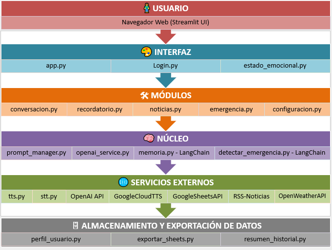

# 🧱 Arquitectura y Estructura del Proyecto

La arquitectura de ABU v2 está diseñada con un enfoque modular y por capas, siguiendo principios de **claridad, separación de responsabilidades y escalabilidad**. Esto permite mantener el código organizado, facilitar futuras mejoras y aislar componentes para su prueba o mantenimiento.

## 📊 Diagrama General



Este esquema representa cómo se comunican las distintas capas: desde la interfaz de usuario hasta los servicios externos de IA, pasando por los módulos funcionales, el núcleo conversacional y los canales de entrada/salida de voz.


## 📁 Estructura del Repositorio

```
ABU-GENAI-V2/
├── app.py                 # Punto de entrada principal (Streamlit)
├── core/                  # Núcleo conversacional e inteligencia artificial
├── features/              # Módulos funcionales accesibles desde la interfaz
├── services/              # Entrada y salida de voz (STT/TTS)
├── storage/               # Exportación de datos, resumen, perfil
├── users/                 # Análisis emocional y perfiles predefinidos
├── access/                # Login y control de sesión
├── assets/                # Archivos multimedia: logos, íconos, audios
├── credentials/           # Claves de API (no públicas)
├── .streamlit/            # Configuración de Streamlit (UI, variables)
├── docs/                  # Documentación técnica (archivos .md)
└── README.md              # Presentación general del proyecto
```

## 🧩 Capas Funcionales

A continuación se detalla cada capa y su rol dentro de la arquitectura:

---

### 🎨 Interfaz (Front-end)

Encargada de la interacción directa con el usuario, a través de componentes visuales y formularios.

- `app.py`: Interfaz principal con Streamlit.  
- `access/login.py`: Inicio de sesión.  
- `users/estado_emocional.py`: Selector emocional con íconos e impacto en la conversación.

---

### 🛠️ Módulos funcionales

Secciones independientes que agrupan funciones clave, invocadas desde la interfaz:

- `features/conversacion.py`: Canal de conversación principal.  
- `features/recordatorio.py`: Agenda personalizada con recordatorios.  
- `features/noticias.py`: Consulta de clima y noticias usando ubicación.  
- `features/emergencia.py`: Activación de alertas a contactos definidos.  
- `features/configuracion.py`: Edición del perfil del usuario.

---

### 🧠 Núcleo conversacional

Procesa las entradas del usuario, genera los prompts y llama al modelo GPT.

- `core/prompt_manager.py`: Arma prompts dinámicos según el flujo conversacional.  
- `core/openai_service.py`: Envía mensajes a la API de OpenAI.  
- `core/memoria.py`: Implementación de memoria conversacional con LangChain.  
- `core/detectar_emergencia.py`: Evalúa riesgos en las respuestas (flujo crítico).

---

### 🌐 Servicios externos

Proveen funcionalidades clave mediante APIs:

- `services/stt.py`: Conversión de voz a texto (Speech-to-Text).  
- `services/tts.py`: Conversión de texto a voz (Text-to-Speech).  
- `credentials/`: Claves necesarias para usar Google Cloud, OpenWeather, etc.

---

### 🗄️ Almacenamiento y datos

Encargado de registrar, resumir o exportar información del usuario y sus interacciones:

- `storage/perfil_usuario.py`: Consolida todos los datos del usuario.  
- `storage/exportar_sheets.py`: Exportación estructurada a Google Sheets.  
- `storage/resumen_historial.py`: Análisis afectivo y resumen de conversación.

---

### 👥 Perfiles y usuarios

Modelos de usuario para pruebas, análisis emocional, y segmentación.

- `users/perfiles_precargados.py`: Carga perfiles ejemplo (Rosa, Pedro, Juan).  
- `users/estado_emocional.py`: Módulo reutilizado por la interfaz y núcleo.

---

### ⚙️ Configuración

- `.streamlit/config.toml`: Configura temas, claves secretas y estilo visual de la interfaz.

---

### 🔄 Comunicación entre componentes

- El usuario interactúa con la interfaz → selecciona una opción o habla.  
- El módulo funcional correspondiente recibe la acción y consulta al núcleo.  
- El núcleo arma el prompt y llama al modelo de lenguaje (OpenAI).  
- La respuesta generada es devuelta, se puede leer en voz alta (TTS), guardar o reenviar.  
- Opcionalmente, la memoria se actualiza y los datos se exportan.

---

> 🧪 Esta sección forma parte del diseño técnico y modular de ABU v2, clave para su mantenibilidad y evolución futura.
